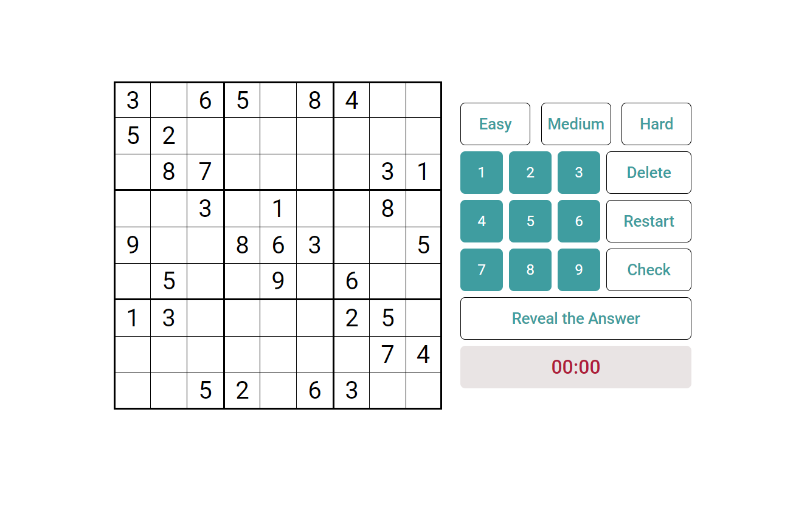

# Sudoku Solver

I Created this project to not only play sudoku but also to show how cool backtracking algorithms are. In addition, by using one of the sudoku Apis I'm able to retrieve different sudokus every time with specific difficulty. 

- Follow the link to [Sudoku Solver](https://gogi22.github.io/SudokuSolver/)
- Pick difficulty
- Start Solving
- Check your answer
- Try to improve your time
- If you get stuck hit `Reveal the Answer`  and watch algorithm do its thing
- Speed it up or down

Website design was inspired by cracking-the-cryptic.web.app
